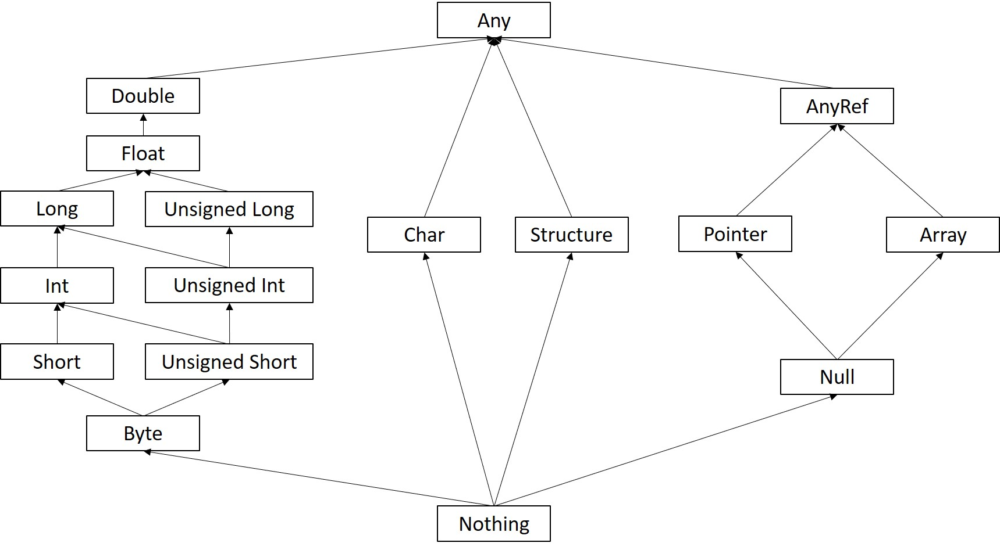

<!-- omit in toc -->
# Agile-C

A Type Inference Transpiler for the C Programming Language

- [Motivation](#motivation)
- [Introduction](#introduction)
- [Getting Started](#getting-started)
- [Features](#features)
- [Overview of Agile-C's Type System](#overview-of-agile-cs-type-system)
- [Overview of Agile-C's Type Inference Algorithm](#overview-of-agile-cs-type-inference-algorithm)
- [Grammar](#grammar)

## Motivation

Type inference now is an important feature for many modern programming languages, aiming to reduce the cognitive load of programmers while not giving up the benefits of static type systems. Type inference systems take many forms, ranging from the famous Hindley-Milner system used in Haskell, local type inference in Rust and Scala, to type deduction for variables in C++ and Java.

However, although the general idea of type inference is quite straightforward, there is a large gap between the theory and a really functional type inference system which is tightly binded to the target language and has to handle tons of cornor cases. Nowadays, it is not easy to find books that take a practical approach (i.e., actually implement a fully functional type inference system) while accessable to programmers who only have average knowledge in programming language theory.

I design and implement Agile-C as my bachelar graduation project, which provides basic type inference for most commen used C features, to get a impression about how type systems and type inference work before I dive into more serious literature.

## Introduction

Agile-C is a transpiler, which consumes a C sourse file that omits certain type declarations and outputs a valid C sourse file. You can also directly invoke GCC using a command-line flag to get the final executable file instead.

During the rest of the document, we will first get you started and introduce C features that are currently supported. Then we will briefly talk about the type system of Agile-C and how it performs type inference before we define the formal grammar.

## Getting Started

Agile-C is written in pure [Rust](https://www.rust-lang.org/) and is precompiled for Windows users. If you want to use features related to GCC, you should make sure GCC can be directly invoked from the command-line.

<!-- omit in toc -->
### Hello World

Create `test.c` with the following code.

``` C
#include <stdio.h>

int main(void) {
    printf("Hello, world!");
    return 0;
}
```

Then open the terminal in the same folder and try the following command.

``` PowerShell
$ ./agile_c.exe --gcc -i ./test.c -o ./test.exe
$ ./test.exe
Hello, World!
```

`--gcc` tells Agile-C to invoke GCC for you, and if you leave out this flag, Agile-C will output the transpiled C source file instead. Then we use `-i` or `--input` to specify the path to the input file and `-o` or `--output` for the path to the output file.

<!-- omit in toc -->
### GCC Arguments

You can provide arguments to GCC by using `args` subcommand. For example, the following command will print the version information of GCC.

``` PowerShell
$ ./agile_c.exe --gcc -i ./test.c -o ./test.exe args --version
gcc (MinGW.org GCC-8.2.0-3) 8.2.0
Copyright (C) 2018 Free Software Foundation, Inc.
This is free software; see the source for copying conditions.  There is NO
warranty; not even for MERCHANTABILITY or FITNESS FOR A PARTICULAR PURPOSE.
```

<!-- omit in toc -->
### Basic C Features

Agile-C supports the most commonly used features of C. Play with the following example to see how much Agile-C can do!

``` C
#include <stdio.h>

struct Counter {
    int num;
};

void add(struct Counter *cnt, int number) {
    cnt->num += number;
}

int main(void) {
    struct Counter cnt = { .num = 0 };
    int numbers[] = { 1, 2 };
    for (int i = 0; i < 2; ++i) {
        add(&cnt, numbers[i]);
    }
    printf("%i", cnt.num);
    return 0;
}
```

``` PowerShell
$ ./agile_c.exe --gcc -i ./test.c -o ./test.exe
$ ./test.exe
3
```

<!-- omit in toc -->
### Type Inference

Now let's omit tedious type declarations! Try the following abbreviated program to see if you can get the same result as the last one.

``` C
#include <stdio.h>

struct Counter {
    int num;
};

add(cnt, number) {
    cnt->num += number;
}

main() {
    struct Counter cnt = { .num = 0 }; // Sadly we cannot omit struct declarations.
    numbers = { 1, 2 };
    for (i = 0; i < 2; ++i) {
        add(&cnt, numbers[i]);
    }
    printf("%i", cnt.num);
    return 0;
}
```

## Features

Here we quickly go through what Agile-C is capable of and a few quirks that you are likly to run into.

- Agile-C supports all kinds of literals, including strings, characters, and numbers. However, you are only allow to use decimals without integer suffixes or scientific notations (i.e. `100L` or `1e3`).
- Most expressions and statements are supported.
- Most primary types are supported, including structures, pointers, and arrays, but excluding specifiers like `const`.
- The only valid initialization syntax for arrays is the brace initialization without designated initializers. For example, `arr = { 1 }` works fine, but `arr = { [0]=1 }` does not work.
- Structures are supported, but the struct definition must be complete (all members must have known types), and the declaration of structure types cannot be omitted. The only valid initialization syntax is the brace initialization with designated initializers (`strcture = { .member = 1 }`), and all members must be explicitly initialized.
- Functions are supported, and the use of `void` for empty parameter lists is also supported (a literally empty parameter list means this function can take any number of arguments).
- For macros, only `#include` is supported.

## Overview of Agile-C's Type System

In short, Agile-C is a weakly and statically typed subset of C, with a constraint-based type inference system.

Agile-C (or in general, C) is weakly typed because it performs implicit type conversions. For example, a C programmer may feel comfortable assigning a `int` to a `long`, but this assignment will be rejected in stronly typed languages (like Rust). What happens here is the C compiler implicitly promotes the `int` to `long` and then performs the assignment.

Agile-C (or in general, C) is statically typed, which means most, if not all, of its type checking happens during the compile time. On the contrary, dynamically typed languages, like Python, does not really care about the type of a variable until this variable is actually used in runtime.

A constraint-based type inference system finds constraints imposed on the type of a certain variable based on how it is used throughout the whole program. We will discuss more details about type inference in the next section.

A diagram illustrating the type hierarchy of Agile-C is shown below. Notice this includes types that are not valid C types and are for internal use only.



## Overview of Agile-C's Type Inference Algorithm

In this section we will explore six steps Agile-C takes to perform type inference and also how Agile-C handle some special cases with a few examples.

<!-- omit in toc -->
### Preprocessing

``` C
#include <assert.h>

main() {
    m = 1;
    assert(m);
    return 0;
}
```

Suppose we have a really simple program as above. The first thing Agile-C does is to consult a internal module to get complete function declarations of `assert.h` and insert them into the source file, so it can later match the usage of function `assert` to its declaration. The transformed program is shown as below.

``` C
#include <assert.h>
void assert(int expression);

main() {
    m = 1;
    assert(m);
    return 0;
}
```

<!-- omit in toc -->
### Parsing

Agile-C implements a Pratt parser (a operator-precedence parser), which associates semantics with tokens instead of grammar rules, with small tweaks on how it parses potentially missing type declarations.

Now agile C can complete missing type declarations in three places: the return type of a function, types for function parameters, and types for variable definitions.

For functions' return types and parameters, the parser knows where types should be, so if the parser fails to find any type there, the parser will insert a dummy type instead.

For variable definitions, the parser will maintain a environment object for each lexical scope, containing names of variables defined in each scope. When the parser produces an assignment expression, it will search those environment objects, and if the variable being assigned is not defined yet, the parser will transform this assignment expression into a definition statement with a dummy type.

For instance, the example program after parsing is shown below. Notice the parser add dummy `T` types for the return type of `main` and variable `m`.

``` C
#include <assert.h>
void assert(int expression);

T main() {
    T m = 1;
    assert(m);
    return 0;
}
```

<!-- omit in toc -->
### Find Known Types

In Agile-C, symbols are basic units for type inference. There are four kinds of symbols: local variables, function parameters, function returns, and expressions. For the example program, we can list important symbols as follow, where `T` type is a dummy type that we need to infer and `byte` is an internal type for unsigned 8-bit integers.

| Symbol ID | Description | Type |
| --- | --- | --- |
| 1 | parameter `expression` of `assert` | `int` |
| 2 | return value of `main` | `T` |
| 3 | variable `m` of `main` | `T` |
| 4 | literal `1` of `main` | `Byte` |
| 5 | literal `0` of `main` | `Byte` |

<!-- omit in toc -->
### Constrain All Symbols

The next step is to find constraints for all symbols. Conceptually, we may treat the data flow of a program as a series of assignments. Suppose we have a expression `a = b`, we can conclude with two constraints: First, the type of the symbol `a` should be at least as powerful as the type of the symbol `b`. Second, the type of the symbol `b` should be at most as powerful as the type of the symbol `a`. In a more concise way, we say `a` is a upper bound of `b`, and `b` is a lower bound of `a`. This idea can be easily generalized to other control flow. For example, function calls are assignments from arguments to parameters plus an assignment from the return value to some other variable. Using this idea, we can expand the symbol table from the last section with upper and lower bounds included.

| Symbol ID | Description | Type | Upper Bound | Lower Bound |
| --- | --- | --- | --- | --- |
| 1 | parameter `expression` of `assert` | `int` | `Any` | 3 |
| 2 | return value of `main` | `T` | `Any` | 5 |
| 3 | variable `m` of `main` | `T` | 1, 4 | 4 |
| 4 | literal `1` of `main` | `Byte` | 3 | `Nothing` |
| 5 | literal `0` of `main` | `Byte` | 2 | `Nothing` |

Each symbol can be bounded by either specific types (e.g., `Any`) or other symbols (Symbol ID). Also notice that symbol 3 is bounded from both directions by symbol 4, which means they should have exactly the same type.

<!-- omit in toc -->
### Resolve Type Bounds

After all type constraints are found, Agile-C will iteratively resolve them for each symbol. Specifically, Agile-C will examine each symbol to check if all its upper and lower bounds have had determined concrete types. If so, it will unify all upper bounds into a single type (let's call it `upper`), and also unify all lower bounds into another single type (let's call it `lower`), then unify `upper` and `lower` to a final concrete type.

Let's do the first iteration manually as an example.

- Symbol 1 has a undertermined bound, i.e. symbol 3.
- Symbol 2 is bounded by `Any` and `Byte` (symbol 5), so we determine its type should by `Byte`.
- Symbol 3 is bounded by `Byte` (unifying symbol 1 and 4) and `Byte` (symbol 4), so we determine its type should by `Byte`.
- Symbol 4 is bounded by `Byte` (symbol 3) and `Nothing`. We also notice it has had a determined type `byte`, which perfectly lays between this interval.
- Symbol 5 is bounded by `Byte` (symbol 2) and `Nothing`. We also notice it has had a determined type `byte`, which lays perfectly in this interval.

After the first iteration, types for all symbols are known and types for symbol 2-5 are also checked (compatible with constraints imposed on them). Now let's begin the second iteration.

- Symbol 1 is bounded by `Any` and `Byte` (symbol 3). We also notice it has had a determined type `Int`, which lays in this interval.
- Other symbols do not change.

Now, types for all symbols are determined and checked.

<!-- omit in toc -->
### Heuristic Resolving

However, more complex programs generally have mutual references between symbols with unknown types. Let's add an `identity` function to our example program.

``` C
#include <assert.h>

identity(n) {
    return n;
}

main() {
    m = 1;
    assert(identity(m));
    return 0;
}
```

Now the problem is the function call to `identity` will cause variable `m` and parameter `n` refer to each other as type bounds, but neither of them have known types, so Agile-C will converge (cannot make further deductions) leaving `m` and `n` unresolved.

How we solve this problem is to add a little heuristic. Specifically, after Agile-C first converges, it will try to resolve each unknown symbol again, ignoring all undetermined type bounds.If doing so does make the type of this symbol clear, Agile-C will try to rerun the resolving process again until it converges again, which also makes sure the type produced by heuristic is indeed compatible with all constraints.

For example, `m` is bounded by a numerical literal (`byte`) and `n`. Now we ignore `n`, then `m` is determined to be `Byte`, and the resolving process will start again.

<!-- omit in toc -->
### Some Special Cases

The six steps we just talks about can handle a large set of programs, but there are still some special cases that need extra processing.

- Infix Expression

Suppose we change `identity` to `add_one`.

``` C
#include <assert.h>

add_one(n) {
    return n + 1;
}

main() {
    m = 1;
    assert(add_one(m));
    return 0;
}
```

Now we have an infix expression in `add_one`. So what is the type relationship between `n`, `1`, and `n + 1`? Intuitively, the type of `n + 1` should be the more powerful type between `n` and `1`, but we cannot represent this constraint by upper and lower type bounds.

To solve this problem, Agile-C will add a special field to each infix expression symbol, containing symbols of its left and right operands. Then in the resolving process, Agile-C can pick the more powerful type from its operands as the overall type of the whole expression.

- Pointer, Dot Operator, and Arraw Operator Transformation

Suppose we want `add_one` to work with pointers.

``` C
#include <assert.h>

add_one_ptr(n) {
    return *n + 1;
}

main() {
    m = 1;
    assert(add_one_ptr(&m));
    return 0;
}
```

Now for expression symbol `*n`, we will have conflict type bounds. How? First, we want to constrain this expression by its relationship with symbol `n`, so we add a type bound of some kinds of pointers. Then, we want to constrain it by its relationship with numerical expression `1`, so now we add a type bound of some kinds of intergers, which conflicts with the last constrain. The problem is this expression takes a symbol of some pointer type but transform it into the type this pointer is pointing to.

To handle pointers, Agile-C adds a special flag so it knows to automatically add or remove pointer wrappers for individual type bounds. For example, `*n` is bounded by `n` of type `Pointer<Byte>` and `1` of Type `Byte`, and Agile-C will remove the `Pointer` wrapper of `n` and now these two types match.

With similar methods, we can also handle dot operators (`structure.member`) and arrow operators (`structure->member`).

## Grammar

The majority of the grammar definition is based on [C18](https://www.iso.org/standard/74528.html) and is rewritten in EBNF.

``` EBNF
<non-digit> ::= "A" | "B" | "C" | "D" | "E" | "F" | "G"
                | "H" | "I" | "J" | "K" | "L" | "M" | "N"
                | "O" | "P" | "Q" | "R" | "S" | "T"
                | "U" | "V" | "W" | "X" | "Y" | "Z"
                | "a" | "b" | "c" | "d" | "e" | "f" | "g"
                | "h" | "i" | "j" | "k" | "l" | "m" | "n"
                | "o" | "p" | "q" | "r" | "s" | "t"
                | "u" | "v" | "w" | "x" | "y" | "z"
                | "_";
<digit> ::= "0" | "1" | "2" | "3" | "4" | "5" | "6" | "7" | "8" | "9";
<type-specifier> ::= "void" | "char" | "short" | "int" | "long"
                    | "float" | "double" | "signed" | "unsigned";


<identifier> ::= <non-digit> (<digit> | <non-digit>)*;
<int-constant> ::= ["+" | "-"] <digit>+;
<floating-constant> ::= ["+" | "-"] <digit>* "." <digit>*;
<char-constant> :: "'" (<non-digit> | <digit> | " " | "\n") "'";
<string-constant> ::= "\"" <char-constant>* "\"";


<declaration> ::= <type-specifier>* <init-declarator-list>;
<init-declarator-list> ::= <init-declarator>
                            | <init-declarator-list> "," <init-declarator>;
<init-declarator> ::= <identifier> ["=" (<assignment-expression>
                                            | <initializer-list>)];
<initializer-list> ::= "{" [<expression> ("," <expression>)*] "}";


<function-definition> ::= <type-specifier>* <identifier>
                            "(" <parameter-list> ")" <compound-statement>;
<parameter-list> ::= "void" | [<type-specifier>* <identifier>]
                    | <parameter-list> "," [<type-specifier>* <identifier>];


<primary-expression> ::= <identifier> | <int-constant> | <floating-constant>
                        | <char-constant> | <string-constant>;
<postfix-expression> ::= <primary-expression>
                        | <postfix-expression> "[" <expression> "]"
                        | <postfix-expression> "(" <argument-list> ")"
                        | <postfix-expression> ["++" | "--"];
<argument-list> ::= <logical-OR-expression>
                    | <argument-list> "," <logical-OR-expression>;
<prefix-expression> ::= <postfix-expression>
                        | ["++" | "--" | "!" | "*" | "&"] <postfix-expression>;
<multiplicative-expression> ::= <prefix-expression>
                                | <multiplicative-expression> "*" <prefix-expression>
                                | <multiplicative-expression> "/" <prefix-expression>
                                | <multiplicative-expression> "%" <prefix-expression>;
<additive-expression> ::= <multiplicative-expression>
                            | <additive-expression> "+" <multiplicative-expression>
                            | <additive-expression> "-" <multiplicative-expression>;
<relational-expression> ::= <additive-expression>
                            | <relational-expression> "<" <additive-expression>
                            | <relational-expression> ">" <additive-expression>
                            | <relational-expression> "<=" <additive-expression>
                            | <relational-expression> ">=" <additive-expression>;
<equality-expression> ::= <relational-expression>
                            | <equality-expression> "==" <relational-expression>
                            | <equality-expression> "!=" <relational-expression>;
<logical-AND-expression> ::= <equality-expression>
                            | <logical-AND-expression> "&&" <equality-expression>;
<logical-OR-expression> ::= <logical-AND-expression>
                            | <logical-OR-expression> "||" <logical-AND-expression>;
<assignment-expression> ::= <identifier> <assignment-operator> <logical-OR-expression>;
<assignment-operator> ::= "=" | "+=" | "-=" | "*=" | "/=" | "%=";
<expression> = <assignment-expression>;


<statement> ::= <declaration>
                | <compound-statement>
                | <expression-statement>
                | <selection-statement>
                | <labeled-statement>
                | <iteration-statement>
                | <jump-statement>;
<compound-statement> ::= "{" <statement>* "}";
<expression-statement> ::= <expression> ";";
<selection-statement> ::= "if" "(" <expression> ")" <statement> ["else" <statement>]
                            | "switch" "(" <expression> ")" <labeled-statement>;
<labeled-statement> ::= "case" <expression> ":" <statement>*
                        | "default" ":" <statement>*;
<iteration-statement> ::= "while" "(" <expression> ")" <statement>
                            | "do" <statement> "while" "(" <expression> ")" ";"
                            | "for" "("
                                [<expression>] ";"
                                [<expression>] ";"
                                [<expression>]
                            ")" <statement>;
<jump-statement> ::= "continue" ";" | "break" ";" | "return" [<expression>] ";";
```
